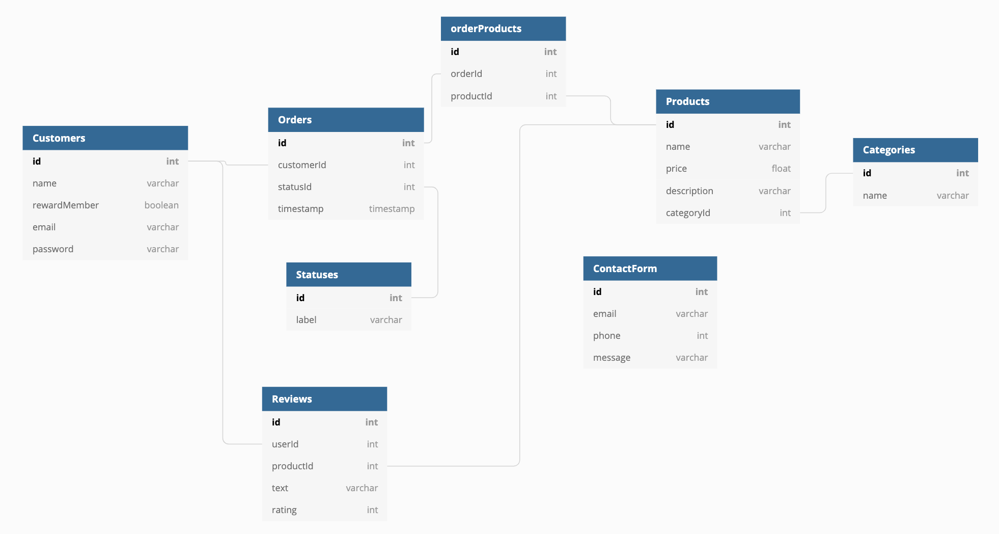

# Sprinkles of Joy
Sprinkles of Joy illustrates a few basic components of an ecommerce app, such as a cart element, order history/status, and individual user accounts.

## Features 
* Requires users to make an account to purchase items and look at their individual order history
* Menu of items that are available for purchase, as well as an option to filter the items by category
* Signed-in users are able to create and delete their reviews on products

## Data Structure

